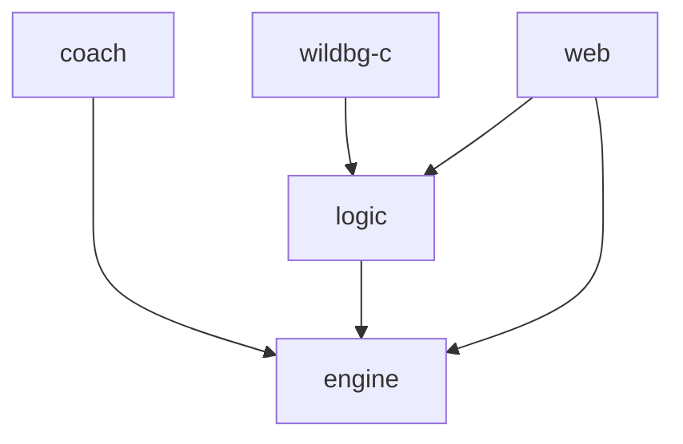

# Internal Architecture

The whole project is split into a Python and a Rust part. The Python part is responsible for training the neural nets, which will take only minutes, once there is training data.
The Rust part is responsible for everything else - so both the engine itself, but also generating training data through rollouts based on older nets. Generating training data takes several days for each iteration.

## Rust crates
The Rust code is split into 5 different crates.

### engine
[`engine`](../../crates/engine) contains the core parts
- Move generation: given a position and a pair of dice – what are legal moves/positions following?
- Inputs generation: given a position – what are the proper inputs for the neural networks?
- Inference of the neural net: given the proper inputs – what are the cubeless money game probabilities for winning/losing normal/gammon/backgammon?
- Best move: Given a position and a pair of dice – what's the best move following?

### coach
[`coach`](../../crates/coach) contains everything to generate training data and compare the performance of different neural networks.

This is achieved by finding many (more than 100,000) positions through self-play and subsequently rolling out these positions.

We then have a large set of positions and probabilities. In other words: we then have a large training set of inputs and outputs for the neural nets.

### logic

While `engine` only deals with cubeless equities, [`logic`](../../crates/logic) is handling cubeful equities, match play and cubes. This is mainly work in progress so far.

### wildbg-c

[`wildbg-c`](../../crates/wildbg-c) is a small layer on top of `logic` which allows C code to access `wildbg`.

### web

[`web`](../../crates/web) contains the HTTP JSON API for bots and GUIs to access the user facing features.

The OpenAPI documentation is autogenerated by the Rust code and can be accessed here: https://wildbg.shuttleapp.rs/swagger-ui/

Currently `web` depends on `logic` and `engine`. In the future we might clean it up and remove the dependency on `engine`.

## Python training

The [training](../../training) folder contains Python code for training the neural networks with PyTorch.

Training data first needs to be generated with [`coach`](#coach). Existing training data can be found in the external repository https://github.com/carsten-wenderdel/wildbg-training

