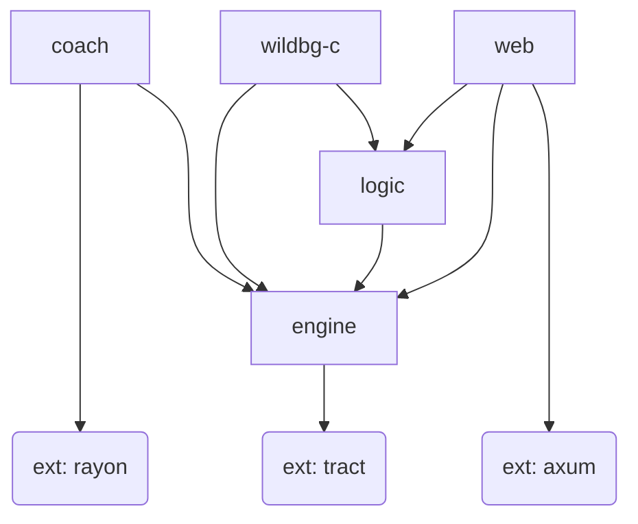

# Internal Architecture

The whole project is split into a Python and a Rust part. The Python part is responsible for training the neural nets, which will take only minutes, once there is training data.
The Rust part is responsible for everything else - so both the engine itself, but also generating training data through rollouts based on older nets. Generating training data takes several days for each iteration.

## Rust crates

The Rust code is split into 5 crates, displayed in the following diagram. Some (not all) _external_ dependencies are also displayed, marked by "_ext_".

### Internal crates

#### engine
[`engine`](../../crates/engine/src) contains the core parts
- Move generation: given a position and a pair of dice – what are legal moves/positions following?
- Inputs generation: given a position – what are the proper inputs for the neural networks?
- Inference of the neural net: given the proper inputs – what are the cubeless money game probabilities for winning/losing normal/gammon/backgammon?
- Best move: Given a position and a pair of dice – what's the best move following?

For a more detailed documentation, see [docs/dev/engine.md](./engine.md).

#### coach
[`coach`](../../crates/coach/src) contains everything to generate training data and compare the performance of different neural networks.

This is achieved by finding many (more than 100,000) positions through self-play and subsequently rolling out these positions.

We then have a large set of positions and probabilities. In other words: we then have a large training set of inputs and outputs for the neural nets.

#### logic

While `engine` only deals with cubeless equities, [`logic`](../../crates/logic/src) is handling cubeful equities, match play and cubes. This is mainly work in progress so far.

#### wildbg-c

[`wildbg-c`](../../crates/wildbg-c/src) is a small layer on top of `logic` which allows C code to access `wildbg`.

For a more detailed documentation, see [docs/user/wildbg-c.md](../user/wildbg-c.md).

#### web

[`web`](../../crates/web/src) contains the HTTP JSON API for bots and GUIs to access the user facing features.

The OpenAPI documentation is autogenerated by `web` and can be accessed here: https://wildbg.shuttleapp.rs/swagger-ui/

Currently `web` depends on `logic` and `engine`. In the future we might clean it up and remove the dependency on `engine`.

#### benchmarks

[`benchmarks`](../../crates/benchmarks/benches) is not displayed in the diagram above.
It doesn't contain any regular source code but benchmarks of the other crates.
They can help you make performance sensitive changes.

You can run them by executing `cargo bench -p benchmarks` from the project's root folder.
For only one benchmark file, execute for example `cargo bench -p benchmarks --bench rollout_bench`.

### External crates

#### rayon

Rollouts done by `coach` are parallelized with the help of [_rayon_](https://github.com/rayon-rs/rayon).

#### tract

We don't implement neural nets ourselves. Instead, we rely on the _ONNX_ format and use [_tract_](https://github.com/sonos/tract) for inference.

#### axum

`web` depends on several external crates, notably the web application framework [_axum_](https://github.com/tokio-rs/axum).

The OpenAPI documentation is generated with the help of [_utoipa_](https://github.com/juhaku/utoipa).

## Python training

The [`training`](../../training) folder contains Python code for training the neural networks with _PyTorch_.

Training data first needs to be generated with [`coach`](#coach). Existing training data can be found in the external repository https://github.com/carsten-wenderdel/wildbg-training

The Python part doesn't know anything about backgammon. Neural net inputs are generated by Rust code.

A detailed _HowTo_ can be found in [docs/dev/training](./training.md).
